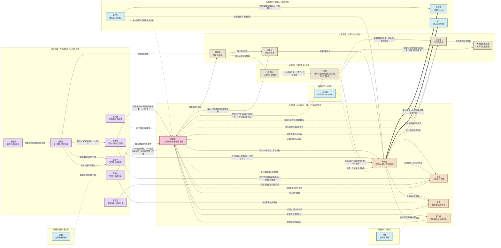

# 新版人物关系图

> 关系图只使用公开中文名、原创国家/政治实体、战队/机构和职业利益边。分镜/档案可以用“贼贼姐”作制作标签；正式章节正文由她以第一人称“我”进入，只写我听见、看到、操作、判断、尴尬和选择的事实。
>
> 实线表示第 1—24 章同队/工作人员关系；粗虚线表示第 25 章离队、第 26 章后新队与第 27 章重逢；点划线表示外队竞争或制度互证。任何边都不得被解释为恋爱、皇权或系统权限。

## Mermaid

## 文字解释

### 1. 开局五席：只在大清战队内部

- **贼贼姐—大表姐：** 大表姐是第 1—24 章资深 IGL；贼贼姐是二号位和条件式复核。她们共同赢局、共同背责任，二号位可以打断报条件，但不能把读对一次写成夺权。
- **贼贼姐—箱姐：** 箱姐的主狙长线提供第二信息；我必须等她的报点再决定补枪，主狙资源不因“贵席”或现代记忆自动让渡。
- **贼贼姐—雨姐：** 雨姐拥有首接触和锚点否决；我在她确认后跟枪，保枪是职业选择，不是胆怯标签。
- **贼贼姐—老六姐：** 老六姐的游走和晚段信息给队伍保留后手；她的晚报信息要经过复读和回放，不能被“神秘”或“消极”一笔解释。

### 2. 教练、工作人员与候补：不替代首发

- 米教姐是大清登记“一教”，负责核心训练、复盘、暂停建议、轮换提案和资源排班；她提出方案但不占五席，正式回合不能代替选手按键或 IGL 发令。
- 戚照霜是执行教练与继任制度负责人，把米教姐的方案落到训练日程、样本、交接和责任记录；大表姐离队后也不自动成为场上首发/IGL。
- 稳火姐是前史交集的前任外聘教练，当前只通过旧训练册、授权复盘和公开职业意见出现；她没有当前首发、资格或合同权限。
- 幕后姐是霜旌队教练兼队务领队，负责外邦训练、复盘、设备/数据/赛务接口和交接连续性；她不替呼延霁、大表姐或冷妹按键，不凭队务身份改赛籍。
- 郗雪篁负责主狙设备、数据和回放索引；她保留主狙专业功能，但不替代箱姐上场。
- 陶令仪负责道具、经济和训练样本；她的资源署名必须进入复盘，不替五席拍板。
- 霍昭宁是注册替补突破手；第 1—24 章只训练。Ch26 只有空席、申请与流程启动，不取得实际临时席；Ch28 才正式申请试位并进入逐项人工确认；Ch30 只完成内部训练确认，正式赛务回执仍待签；Ch31 赛前才逐图登记生效。
- 燕归迟是非报名训练候选；她可以争独立发言，但不进入正式赛注册首发或替补。

### 3. 第25章离队与第27章重逢

- 大表姐第 1—24 章始终在大清战队；第 25 章由本人、队伍、协会和赛务办理离队、合同、赛籍、设备和数据交接。
- 第 26 章起大表姐属于北凛联邦霜旌队，呼延霁和冷妹是新队成员；大清留下贼贼姐、箱姐、雨姐、老六姐和一个尚未生效的空席，霍昭宁按 Ch26 启动、Ch28 申请、Ch30 内训确认、Ch31 逐图登记生效的流程竞争临时第五席。
- 第 27 章起才写大清旧队与霜旌队重逢；重逢边落到地图、经济、合同、回放和公开责任，不能写成自动和解或私情审判。

### 4. 公共层与外邦

- 晏听澜掌证据，不掌赛中指挥；顾折枝掌赛务合法性，不掌枪法；洛遥音掌公众麦克风，不掌比分；大清国朝电竞署掌预算和代表资格，不得越过五席约改首发。米教姐、戚照霜和幕后姐的建议都必须经过队长、五席、队务/协会和赛务的人工确认。
- 追问姐、冲妹和稳姐分别从外邦战术追问、快攻窗口和支援合同对照大清职责；她们不是第二支中国原生队，也不替换大清五席。

### 4.1 沈衡与记录链

沈衡的边只指向国策、预算总盘、任免和公开责任。协会/司竞监、队长、教练、队务/分析、回录和当事人仍各自保留会签、回执、执行与选择；具体资源、首发、设备、合同、赛籍、暂停和临时席不能由沈衡单签。天工中枢只提供记录、异常和评估材料，不替任何人发令、选人、改比分或解释关系。

沈衡与贼贼姐的边是制度对手、责任见证和有限合作，不是恋爱、外挂来源或终极反派边；她与大表姐的边必须经过本人离队、合同、赛籍、设备/数据交接和跨国附约。六场真人节点固定为 Ch12、Ch16、Ch25、Ch34、Ch42、Ch44；Ch23—26 只算一组决策链，真人只在 Ch25。

### 5. 称呼和正文接口

- “小贼贼”只在亲近、照顾、老队友或较亲密场合出现；须有具体共同训练、补枪、照顾或旧队友证据。
- “狗贼”只在赛场互呛、熟人损人或复盘甩锅式玩笑出现；须有共同回合或已建立的互损关系。
- “贼姐姐”只在外队、后辈、直播或半认真调侃出现；不是职位。
- “总监”只属于观众/直播公共外号；不是职位、官职、队长或权限。
- 正式章节正文用“我”；关系图使用“贼贼姐”只是制作标签。电脑、服务器和比赛机制只提供事实，所有首发、离队、替补、暂停和合同都由人/组织确认。

### 6. 称呼边线：关系证据先于昵称

关系图中的边只记录职业协作、公开交锋和已经发生的关系证据，不预先给人物发昵称。没有证据的边默认使用“贼贼姐”；“小贼贼”“狗贼”“贼姐姐”必须在对应场景中由具体动作托住，且不是职位、座次、权限或系统等级。宫廷礼法戏只改变句式，不改变边的关系状态。

| 关系边 | 默认称呼 | 可升级的证据与场景 | 降级/回到正式层 |
|---|---|---|---|
| 贼贼姐—大表姐 | 贼贼姐 | 共同赢局、共同背责任后，私下可用“小贼贼”；某次闪、补枪或经济决定形成互接复盘后，可用“狗贼” | 首发、合同、赛籍或离队争议时，在公开流程中恢复“贼贼姐” |
| 贼贼姐—雨姐 | 贼贼姐 | 雨姐先承担入口风险、主角完成跟枪/补枪或出现设备照顾后，私下可用“小贼贼” | 入口否决或责任争议未被接住时，停止昵称，回到报点和公开名 |
| 贼贼姐—老六姐 | 贼贼姐 | 晚段信息、反默认或复盘甩锅有可回放事实后，可用“狗贼” | 没有共同回合、进入正式复盘或互损伤到责任时，恢复公开名；不自动升级“小贼贼” |
| 贼贼姐—冷妹 | 贼贼姐 | 已有公开对局、赛照交接或外队接待后，冷妹可用“贼姐姐” | 进入合同、赛务、赛台正式口径时改用“贼贼姐”；外队称呼不自动变成队内亲近 |
| 贼贼姐—顾折枝 | 贼贼姐 | 门禁、入席、设备验收、暂停回执等礼法戏可用“贼贼姐，烦请……”；这是流程语气，不是亲近 | 回到赛务事实时仍用“贼贼姐”，不使用“总监”或任何官职式昵称 |
| 贼贼姐—洛遥音/观众 | 直播公共层的“总监” | 只在弹幕、解说、直播标题或观众口中出现 | 不得进入队内语音、私人对白、名册、合同或关系边；不能反向证明任何亲近关系 |

关系图不把称呼写成自动升级箭头。每次在分镜或正文调用昵称，都要能回指到共同回合、训练/照顾、复盘回应、公开交锋或接待流程；如果当前边只有职业标签而没有证据，继续使用“贼贼姐”。正式正文仍由贼贼姐第一人称“我”进入，关系图上的角色标签不改变这一点。
