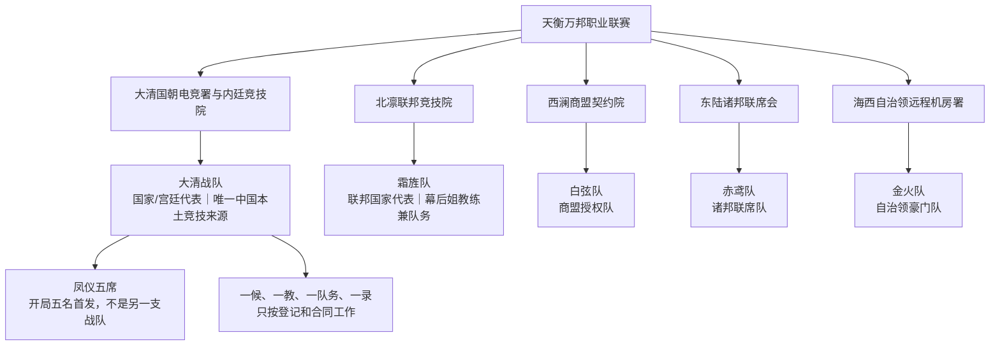

# 多国战队与赛季制度

> 本文件只写平行世界公开制度。现实职业交集和现实队伍只在 `设定/03_中文化职业原型映射.md` 与内部研究报告中核稿。

## 1. 联赛总图

大清战队是大清政体代表，也是唯一中国本土竞技来源。训练组、候补桌、试训席和绛霜宫所属训练基地都不是另一支中国战队。其他队伍来自原创外邦政治实体，国别通过合同、签证、设备、语言、训练、外交和战术产生实际后果。

## 2. 国家与战队卡

| 国家/政治实体 | 战队 | 公开组织逻辑 | 训练/合同条件 | 比赛功能 |
|---|---|---|---|---|
| 大清帝国 | 大清战队 | 国家资源集中，内廷竞技院负责日常训练，司竞监负责赛务 | 宫籍合同、阶段首发、数据/回放署名、离队和交接条款必须人工签署 | 开局五人共同承担国家代表、五席和舆论压力 |
| 北凛联邦 | 霜旌队 | 公开训练板，幕后姐负责教练/队务连续性，队长双签与联邦赛照并行 | 队长职责、借调期限、退出条件和外邦赛照可审计 | 默认纪律强；第 26 章后接收完成转队的大表姐 |
| 西澜商盟 | 白弦队 | 数据和合同服务驱动的授权队 | 地图、回放、数据、肖像使用范围细；退出条款清楚但商业授权复杂 | 以回放解释、二次确认和契约边界挑战大清 |
| 东陆诸邦 | 赤鸢队 | 轮换赛籍和短窗口会盟队 | 赛季合约、五秒合法决定窗口、贡献邦与队员来源分开 | 快攻、反经济和新人合法发言迫使大清改默认 |
| 海西自治领 | 金火队 | 远程机房和设备资源充足的豪门队 | 海运设备、远程延迟、固定席合同和阵容变动互相制约 | 其他原创主狙、支援和设备条件让大清面对复现性问题 |

## 3. 大清战队开局编制

### 3.1 实际首发五席（第 1—24 章）

| 首发 | 登记职责 | 可作的决定 | 不拥有的权力 |
|---|---|---|---|
| 贼贼姐 | 二号位步枪、补枪、残局、条件式复核 | 报人数/位置/时间；在触发条件成立后提出中段变化 | 不能越过大表姐自动拍板，不能替队友解释 |
| 大表姐 | 资深 IGL、默认、经济、暂停、赛点责任 | 现场最终口令和全队节奏；签下整队回合责任 | 不能拥有队友永久去留，不能把离队先定性为背叛 |
| 箱姐 | 主狙、长线、远点信息、关键残局第一枪 | 说明 AWP 角、主狙资源和长线风险 | 不能以高光自动取得队长或赛务权 |
| 雨姐 | 首接触、锚点、保枪、入口风险 | 说明前压、停冲、保枪和第一枪条件 | 不能因老将资历自动保留首发，也不能被 K/D 单独淘汰 |
| 老六姐 | 游走、晚段信息、反默认、残局解释 | 说明等待窗口、漏洞、经济和公开回放来源 | 不能把低可见度变成逃避团队责任或独占数据权 |

这五人是开局唯一的比赛五席。她们之间的冲突必须落在职责、指挥、资源、旧债和信任，不能拿工作人员或系统替代她们做选择。

### 3.2 教练、队务、分析、候补与协会分层

| 角色 | 公开归属 | 是否比赛五席 | 有效戏剧功能 |
|---|---|---:|---|
| 米教姐 | 大清战队登记“一教” | 否 | 核心训练、暂停建议、复盘、轮换提案和资源排班；不能代替选手发令或按键 |
| 戚照霜 | 大清战队执行教练、继任制度负责人 | 否 | 把训练方案落到日程、样本、交接和责任记录；不能独占核心教练权 |
| 郗雪篁 | 大清战队主狙/设备与数据队务 | 否 | 维护 AWP 训练、设备验收、数据授权和资源争议；不再占用箱姐的主狙席 |
| 陶令仪 | 大清战队道具与训练分析师 | 否 | 烟闪火、经济、道具复现、训练预算和支援责任分析；不再占用队内支援首发 |
| 霍昭宁 | 大清战队注册替补突破手 | 否（开局） | 保留第一接触、撕空间和高风险判断；只有在地图、合同、赛务和队长共同确认后才可替补上场 |
| 燕归迟 | 内廷训练院非报名候补训练组 | 否 | 保留锚点、第二指挥和独立发言训练；不能自动进入比赛名单 |
| 晏听澜 | 回录司一录 | 否 | 记录画面、语音、经济、设备和责任，不在比赛中决定首发 |
| 顾折枝 | 司竞监赛务官 | 否 | 核验国朝籍、赛籍、队籍、五席、暂停、替补和申诉，不决定枪法与胜负 |
| 洛遥音 | 观议司传播官 | 否 | 管理直播、剪辑、采访和公众解释；不得把标签变成席位 |

### 3.3 大表姐离队后的五席变化

第 25 章完成大表姐离大清的申请、听证、队籍、赛籍、签证、装备、数据和席位交接；第 26 章才入霜旌并完成外邦接收，同时只保留大清空席、申请与流程启动，不让霍昭宁取得临时席；第 28 章正式申请试位并逐项人工确认，第 30 章内部训练确认但正式回执待签，第 31 章赛前逐图登记生效。没有任何系统或宫令自动换人。贼贼姐、箱姐、雨姐、老六姐仍是留队核心；米教姐继续作为登记“一教”，戚照霜继续在执行教练席，郗雪篁、陶令仪、燕归迟继续在各自非比赛岗位。

离队后的临时拍板由留队选手作出：贼贼姐负责条件式中段沟通，雨姐承担现场老将短口令，箱姐和老六姐提供地图信息；戚照霜只能给训练/暂停建议。后续是否固定、由谁签最终口令，必须在剧情中通过训练和合同选择完成。

## 4. 赛季与积分

天衡赛季分为四阶段，全年只使用一套公开积分账：

1. **外邦赛照与阵容注册周：** 各队提交五名首发、一名替补、一名教练、一名队务/分析人员、一名回录/数据人员、地图池声明和合同期限。赛务官人工核验国朝籍、赛籍、队籍、签证和五席状态。
2. **万邦小组赛：** 各队循环 BO3。系列赛胜者得 3 分，打满加赛后取胜得 2 分，负者得 1 分，因赛务违规或未能入场得 0 分；地图胜负和回合差用于同分排序。大清直接以国家/宫廷赛籍参赛，国内没有另一支本土队竞争。
3. **季后赛：** 积分前四进入双败或单败赛段，由赛务公告锁定。每轮 BO3；外邦签证、设备清关、翻译和训练房确认直接影响赛前准备。
4. **凤仪总决：** BO5，地图禁选顺序由队长和赛务官共同确认。冠军获得下一赛季优先赛照、积分奖励和资源谈判权，但不获得永久首发或国家行政权。

积分只记录赛果、地图和赛务纪律，不计算好感、宫斗值或权限等级。个人数据进入复盘和合同谈判，由人解释。

## 5. 统一注册编制

每队必须登记“一队五席、一候、一教、一队务/分析、一录”：

- 五席：第一接触、主狙、支援、二号位/灵活步枪、队长/IGL 可按队伍结构重叠，但每张地图必须写清默认位置。
- 一候：替补至少训练两种职责，拥有合同、训练记录和责任栏；候补不等于罚站，也不能被电脑自动顶替。
- 一教：米教姐可改训练方案、安排复盘、提交暂停/轮换/赛前建议和资源排班，正式回合不能代替选手发令或按键；执行教练可协助落地，但不能把建议升级为自动权限。
- 一队务/分析：负责设备、道具、合同字段、训练资源和数据解释，不占比赛五席。
- 一录：记录画面、语音、经济、设备、赛务操作和责任，不在比赛中决定首发和策略。

首发变更须经队长、教练、队务/协会代表和选手本人共同确认。跨境选手还要确认签证与合同是否允许该地图、该阶段和该场次上场。

## 6. 合同、签证、语言与外交

### 6.1 合同最低字段

每份职业合同至少写明：赛季期限、首发/替补状态、地图职责、训练时段、设备归属、数据与回放使用权、肖像/采访范围、旅行与保险、退出/转会条件、赛后责任和争议解决机构。

合同不能以“效忠某人”“接受私下占有”换首发。国家或宫廷管理层可以提出国家名义、公开口径和资源服务义务，但必须有期限、有签章、有退出路径。

### 6.2 跨境影响

- 外邦赛照决定能否进入赛台；签证延期会让一名选手错过地图禁选或只能远程训练。
- 设备申报和清关决定鼠标、耳机、显示器和备用设备是否按时到位。
- 语言与译员决定暂停、战术白板和赛后采访的误差；正式赛务必须有可核对的共同口令。
- 外交关系会改变训练房开放、媒体席位和申诉速度，但不能直接改变已经打完的比分。
- 合同期限决定选手是否愿意冒险换位；任何首发都可以留到决赛，也可以依法离开，不因暧昧或国家口号而被扣押。

## 7. 大表姐离队的平行程序

第 1—24 章，大表姐是大清战队首发 IGL，与贼贼姐、箱姐、雨姐、老六姐共同训练、共同赢下比赛、共同背锅和共同签责任。她与米教姐的张力是训练结构、默认与临场二次判断；她与戚照霜的张力是执行日程、继任制度和交接边界，不是两名首发争同一原型席。

第 25 章，职业路线、队内决策、国家代表期限、合同/尊严和数据署名问题叠加，大表姐提出并完成离队办理。顾折枝负责赛务合法性，郗雪篁负责设备/数据交接，陶令仪核对训练资源与道具账，洛遥音处理公开口径，米教姐提供核心教练意见，戚照霜落实交接记录；霜旌队的幕后姐负责外邦接收接口。这些工作人员不能替她发声或替五席决定。

第 26 章以后，大表姐才以霜旌队外邦主将身份出现。霜旌队的新队长结构由呼延霁、大表姐和冷妹共同按北凛规则处理；大清的“叛逃”标签与霜旌队的合同事实并列，读者自行判断。第一次重逢必须通过公开接待、联合训练或正式对阵发生，不用现实记忆自动读心。

## 8. 连续性检查

写任何新国家、队伍或选手前，必须能回答：谁签发赛籍、谁提供训练资源、谁能改五席、谁能提交申诉、选手如何离队、失败由谁签责任。答案必须落到名册、合同、门牌、设备单、回放、赛台或公开记录上。

## 9. 皇帝线与具体资源会签链

### 9.1 沈衡的制度位置

沈衡是大清帝国的成年女性皇帝，正文称“皇帝”或“陛下”。她可以定国策、预算总盘、任免失职官员、签外交赛约和承担公开责任。皇权可以决定国家政策和预算总盘，但不能直接成为某名选手具体训练时段、设备、枪械、首发、合同或赛务资格的执行来源；恋爱、性关系仍绝不成为上述来源。

| 权限层 | 可以做的事 | 必须保留的边界 |
|---|---|---|
| 沈衡 | 国策、总预算、公开条件、任免、外交赛约、责任令 | 不单签设备、枪械、首发、临时席、合同、赛籍、暂停或比分 |
| 国朝电竞署/协会/司竞监 | 预算拨付、赛籍、地图池、暂停、申诉、审计和回执 | 保留会签、否决和赛务复核，不替五席打枪或拍板临场 |
| 队长/五席 | 默认、经济、地图、暂停口令、临场选择和回合责任 | 由当事人承担结果，不能把皇帝批预算当成个人授权 |
| 教练 | 训练判断、复盘、暂停建议、轮换提案、资源排班 | 不代替 IGL 发令、不代替选手按键、不改已发生比分 |
| 队务/分析/回录 | 设备验收、合同字段、道具样本、数据、回放、责任记录 | 不占五席、不替本人选择合同或离队、不自动生成资格 |
| 选手本人 | 合同确认、离队、跨国附约、训练风险和临时席选择 | 选择必须有文件与回执，不能由皇帝强留或强换 |
| 天工/AI | 保存记录、整理异常和生成评估材料 | 不发任务、不选首发、不授资源、不替人解释动机 |

规则句：**皇权可以决定国家政策和预算总盘，但不能直接成为某名选手具体训练时段、设备、枪械、首发、合同或赛务资格的执行来源；恋爱、性关系仍绝不成为上述来源。** 具体资源仍必须经过机构会签、回执、执行和当事人选择。预算写入国家账后，还要能指出谁提出、谁核对、谁拨付、谁验收、谁承担舆论后果。

### 9.2 Ch1 与称呼连续性

Ch1 现代男性阶段第一人称“我”可被叫“贼贼”，队友使用“大表哥”“箱子”等男性外号；意识错位并经声音、手、鼠标与重心、头发服装成本、队友和名册逐步确认平行女性后，才使用“贼贼姐”“大表姐”“箱姐”“雨姐”“老六姐”。这是阶段性命名证据，不是漂移。Ch1 无沈衡真人、无皇帝声音，也不以皇帝影子替代主角的比赛危机。

### 9.3 离队链固定

Ch23—26 是一条决策链，但真人皇帝只落 Ch25：Ch23/24 通过合同、舆论、预算栏和待审回执推进，Ch25 由大表姐本人完成离大清、赛籍、设备、数据和跨国附约交接，Ch26 才写入霜旌生效、霜旌接收、大清空席和霍昭宁申请流程启动；霍昭宁不取得临时席。不得用皇令自动换人、自动转队或把忠诚审判替代合同与本人选择。
